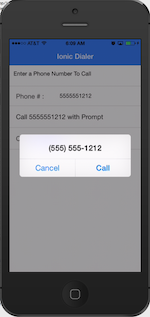
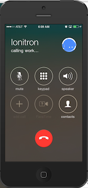

# ionicDialerDemo
Making Calls In Ionic Framework Apps without the User Prompt

## Instructions

```sh
ionic start ionicDialerDemo https://github.com/calendee/ionicDialerDemo
cd ionicDialerDemo
cordova plugin add org.apache.cordova.inappbrowser
ionic platform add ios
```

## Samples

**Prompted to Call**




**Called without Prompt**




## Demo
Using the Ionic View App, you can run this on your phone.  The App ID is 60da48a2